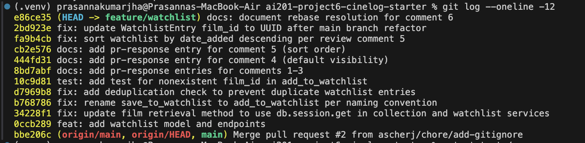

# PR Response Doc — CineLog Watchlist Feature

## AI Usage
I used AI assistance in this project. 

## Comment 1 — Rename
**What I did:** Renamed `save_to_watchlist()` to `add_to_watchlist()` in `services/watchlist_service.py`, updating the docstring to match. Updated the one call site in `routes/watchlist/watchlist.py` (both the import statement and the function call inside `add_film()`).
**How I verified:** Ran `grep -rn "save_to_watchlist" . --include="*.py" --exclude-dir=.venv` across the whole codebase to confirm no references to the old name remained. It returned no results, confirming a clean rename.

## Comment 2 — Deduplication
**What I did:** Added a duplicate check to `add_to_watchlist()` following the exact pattern used in `add_to_collection()` (`services/collection_service.py`): query for an existing `WatchlistEntry` matching `user_id` and `film_id`, and raise an error if one is found, before creating the new entry. I added a new `AlreadyInWatchlistError` exception class rather than reusing `AlreadyInCollectionError`, since a watchlist duplicate is a distinct concern from a collection duplicate — the collection service's own errors are named per-domain, and reusing its exception would blur that boundary.
**How I verified:** Ran the full test suite (`pytest tests/ -v`) after the change to confirm no existing tests broke, and manually confirmed the dedup check placement matches `add_to_collection()`'s order of operations (film-existence check first, then duplicate check, then insert).

## Comment 3 — Missing test
**What I did:** Created `tests/test_watchlist.py`, mirroring the fixture structure (`app`, `sample_user`, `sample_film`) and assertion style from `tests/test_collection.py`. Wrote `test_add_to_watchlist_nonexistent_film_raises`, modeled directly on `test_add_to_collection_nonexistent_film_raises`, asserting that `add_to_watchlist()` raises `FilmNotFoundError` for a nonexistent `film_id`. Note: since the branch is still pre-UUID-refactor, I used an integer fake ID (`999999`) rather than a UUID string, matching the current state of `Film.id`.
**How I verified:** Ran `pytest tests/test_watchlist.py -v` to confirm the new test passes in isolation, then `pytest tests/ -v` to confirm all 5 tests (4 existing + 1 new) pass together.

## Comment 4 — Default visibility
**My position:** Watchlists should default to `public=False` (private).
**Reasoning:** A watchlist can reveal something a user finds embarrassing or doesn't want broadcast — genre choices, guilty pleasures, or films tied to something personal. Defaulting to private respects that users may not realize their list is visible until they choose to share it, rather than opting them into exposure by default.
**Tradeoff acknowledged:** This costs CineLog some of its "community" discovery value — if watchlists are private by default, users can't stumble on friends' saved films as easily, which risks feeling less social and could cost engagement. To offset that, `public` stays available as an explicit per-list toggle (see stretch feature), so users who want the social discovery aspect can opt in rather than being defaulted into it.

## Comment 5 — Sort order
**My position:** Agreed — sort watchlist by `date_added` descending (most recent first), not alphabetical.
**Reasoning:** Users adding films to a watchlist are usually acting on a recent impulse (a recommendation, a trailer, a conversation) and want to see what they just added at the top, not buried alphabetically. This also matches `get_collection()`'s existing sort behavior, keeping the two features consistent.
**Engagement with reviewer's point:** The reviewer's reasoning — that most users want to see what they added recently — matches the existing pattern in `collection_service.py`, so implementing it also improves consistency across the app rather than introducing a one-off sort rule just for watchlists.

## Comment 6 — Rebase
**What conflicted:** Rebasing onto `main` surfaced two issues: (1) a textual conflict in `.gitignore`, since both branches added one independently, and (2) a silent structural conflict — the `main` branch's UUID refactor (`refactor: migrate film IDs from integer to UUID`) rewrote `models.py`'s `Film` and `CollectionEntry` classes, and when my branch's commit tried to add the new `WatchlistEntry` class to the same file, git applied the patch without an explicit conflict marker but silently dropped the `WatchlistEntry` class entirely, since the surrounding lines it expected no longer matched.
**How I resolved it:** Merged the `.gitignore` conflict by keeping both branches' entries. For the missing `WatchlistEntry` model, I manually re-added the class to `models.py`, changing `film_id` from `db.Integer` to `db.String(36)` to match the UUID refactor. I also updated the stale integer-based docstrings and comments in `services/watchlist_service.py` and `routes/watchlist/watchlist.py`, and changed the fake film ID in `tests/test_watchlist.py` from an integer literal to a UUID-format string to stay consistent with the rest of the codebase.
**How I verified no conflict remains:** Ran `pytest tests/ -v` after the fix — all 5 tests pass. Confirmed `git log --oneline --graph` shows a fully linear history with no merge commits, sitting cleanly on top of `origin/main`.

### Screenshot — git log --oneline

## PR Description

### What this feature does
Adds a watchlist feature to CineLog, allowing users to save films they intend to watch later, separate from their collection of already-watched films. Includes a `WatchlistEntry` model, service functions (`add_to_watchlist`, `get_watchlist`), and REST endpoints (`GET /watchlist/<user_id>`, `POST /watchlist/<user_id>/add`).

### Design decisions
- **Default visibility:** Watchlists default to `public=False` (private). Watchlists can reveal personal or embarrassing viewing preferences, so users are opted into privacy by default rather than exposure. This trades off some of CineLog's social discovery value, which can be recovered later via an explicit visibility toggle.
- **Sort order:** Watchlists are sorted by `date_added` descending (most recent first), matching the reviewer's preference and staying consistent with how `get_collection()` already sorts entries.

### How to manually test
1. Start the app: `python app.py`
2. Create a user and a film via the appropriate endpoints (or seed data, if available).
3. Add a film to the watchlist:
4. View the watchlist: `GET /watchlist/<user_id>` — confirm the film appears.
5. Attempt to add the same film again — confirm an `AlreadyInWatchlistError` is raised (duplicate not created).
6. Attempt to add a nonexistent `film_id` — confirm a `FilmNotFoundError` is raised.
7. Add a second film and confirm `GET /watchlist/<user_id>` returns it before the first (newest first, by `date_added`).
